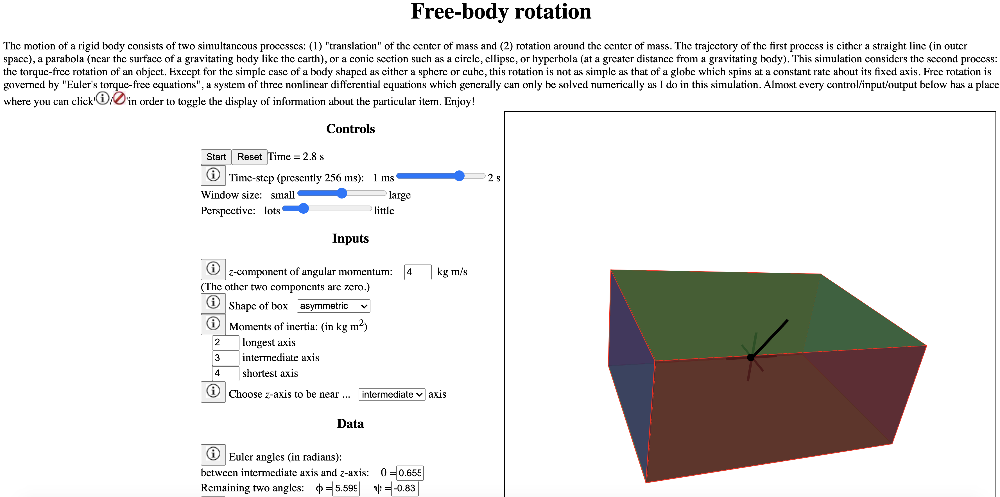

# Contents

[Heroku deployment](https://rotating-body.herokuapp.com)

I used this [skeleton](https://github.com/mars/create-react-app-buildpack#user-content-quick-start) for my front-end project.

[Physics](#physics)

[return to "Contents"](#contents)

[go to next section ("? ? ?")](#?-?-?)

The [rotation](https://en.wikipedia.org/wiki/Euler%27s_equations_(rigid_body_dynamics)) of a
[rigid body](https://en.wikipedia.org/wiki/Rigid_body) is more complicated than most people think.

[? ? ?](#?-?-?)

[return to "Contents"](#contents)

[return to previous section ("Physics")](#physics)

[go to next section ("? ? ? ?")](#?-?-?-?)
